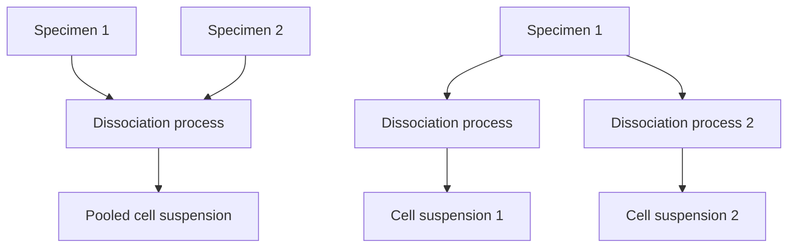
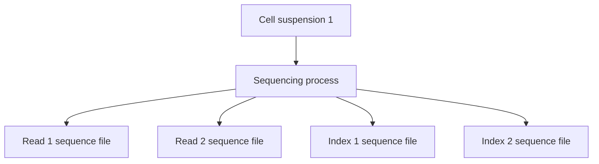

# Programmatic submissions

## Purpose of this document

This document is intended to give an introduction to the HCA ingest service, specifically targeting data and metadata in the system and how they interact in the ingest ecosystem of data.

This document will be coupled with a set of python notebooks, which will show examples of how to interact with the data.

## Terminology
- HCA: Human Cell Atlas
- DCP: Data Coordination Platform
- Project: In the context of the HCA DCP Ingest Platform, the term `project` may have one of 2 meanings:
  1. When referring to metadata, the JSON file that contains the metadata about a project
  2. When referring to a submission/dataset, these 3 terms can be used interchangeably. Used to describe the 

## Understanding the metadata schema

The metadata schema is the staple of how data is interpreted in the system; it defines the content, validation rules and
structure of all the metadata that is in the system. For the Human Cell Atlas Data Coordination Platform, a JSON schema
was chosen to define the metadata in the system. For full details, please refer to the [metadata schema SLO](https://github.com/HumanCellAtlas/metadata-schema/blob/master/docs/metadata_slo.md)
and [rationale](https://github.com/HumanCellAtlas/metadata-schema/blob/master/docs/rationale.md) documents.

### Structure

The metadata schema is structured as stated in the [metadata entity model](https://github.com/HumanCellAtlas/metadata-schema/blob/master/docs/structure.md#metadata-entity-model)
of the [structure.md](https://github.com/HumanCellAtlas/metadata-schema/blob/master/docs/structure.md) document of the 
metadata schema repository.

For the purpose of this guide, "type entity" will be used to refer to the subtypes of the 5 major entities in the metadata model:
- Project: Contains information about the project, such as manuscript metadata, grants involved, contributors of the project etc
- File: Contains information about the data files, such as filename, description of the content, etc
- Biomaterial: Contains information about each of the biological materials used in the project, such as cell suspensions, specimens, etc.
- Project: Contains information about each of the protocols used on each step of the experiment.
- Process: Contains information about a process; usually, we don't need to worry a lot about processes, as they are used as intermediates in the system to create the relationships in between the other elements.

The schemas accepted for each of the major entities can be found always under the url `https://github.com/HumanCellAtlas/metadata-schema/tree/master/json_schema/type/{major_entity}`,
substituting `{type}` with  any of the major types described previously (e.g. https://github.com/HumanCellAtlas/metadata-schema/tree/master/json_schema/type/biomaterial)

### 

### What constitutes a project/submission

All our projects are made of "type entities", each one of those containing metadata that describes either a piece of experimental design.
These

Below you can find an example of a whole project and submission, and how the entities relate to each other: you can click on each of the 
entities to be redirected to the folder of the metadata schema that contains all the type entities of that class.

Most of the relationships allowed by the system are `M:N`; what this means, is that given the following:
- Biomaterial/file
- Process

All of the following scenarios are possible

A general rule of how experiments are modeled in the HCA:
- The input of a process can be one/several biomaterial/files
- The output of a process will be either one biomaterial or one/several files
- A process is unique and cannot be used multiple times.
- (Not shown in figure) A process can have as many protocols attached as needed

Please take into account that there are exceptions; these rules apply to our modelling decisions rather than to limitations
of our system, so if you feel that these rules do not apply to your experiment, please contact us at [the wrangler email](mailto:wrangler-team@data.humancellatlas.org).

## Metadata files in the system

### Ontologised fields

### Extra information

#### _links

## How are 

## 